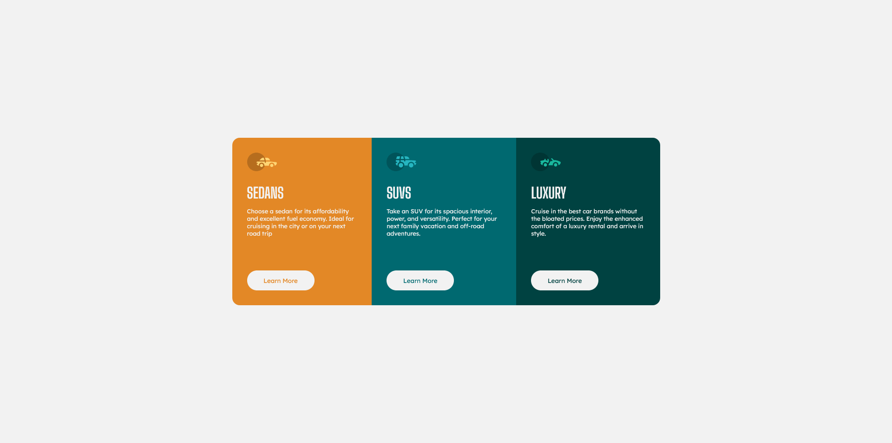

# Frontend Mentor - 3-column preview card component

This is a solution to the [3-column preview card component challenge on Frontend Mentor](https://www.frontendmentor.io/challenges/3column-preview-card-component-pH92eAR2-). Frontend Mentor challenges help you improve your coding skills by building realistic projects. 

## Table of contents

- [Overview](#overview)
  - [The challenge](#the-challenge)
  - [Screenshot](#screenshot)
  - [Links](#links)
- [My process](#my-process)
  - [Built with](#built-with)
  - [What I learned](#what-i-learned)
  - [Useful resources](#useful-resources)
- [Author](#author)

## Overview

### The challenge

Users should be able to:

- View the optimal layout depending on their device's screen size
- See hover states for interactive elements

### Preview

- [Live Site URL](https://3cars-component-card.netlify.app)

## My process

### Built with

- Semantic HTML5 markup
- Sass with Flexbox

### What I learned

Using Sass to leverage the time I spend writing my CSS code. This project allowed me to understand why Sass has became so popular and important to learn.

### Useful resources

- [Sass Tutorial for Beginners - CSS With Superpowers](https://www.youtube.com/watch?v=_a5j7KoflTs&t) - This helped me understand the benefits and how to organize my .scss files, as well as the importance of Sass in the industry.

## Author

- Frontend Mentor - [@dnewbie25](https://www.frontendmentor.io/profile/dnewbie25)
- DevChallenges - [dnewbie25](https://devchallenges.io/portfolio/dnewbie25)
