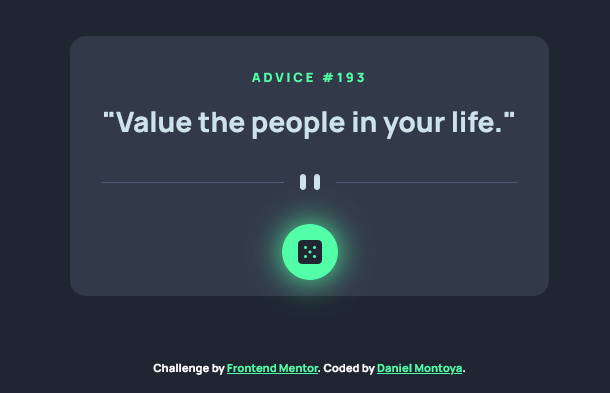

# Advice generator app solution

This is a solution to the [Advice generator app challenge on Frontend Mentor](https://www.frontendmentor.io/challenges/advice-generator-app-QdUG-13db). 

## Table of contents

- [Overview](#overview)
  - [The challenge](#the-challenge)
  - [Screenshot](#screenshot)
  - [Links](#links)
- [My process](#my-process)
  - [Built with](#built-with)
  - [What I learned](#what-i-learned)
  - [Useful resources](#useful-resources)
- [Author](#author)

**Note: Delete this note and update the table of contents based on what sections you keep.**

## Overview

### The challenge

Users should be able to:

- View the optimal layout for the app depending on their device's screen size
- See hover states for all interactive elements on the page
- Generate a new piece of advice by clicking the dice icon

### Screenshot

### Links

- [Solution URL](https://github.com/dnewbie25/Frontend-Mentor/tree/main/advice-generator-app-main)
- [Live Site URL](https://advices-random-generator.netlify.app)

## My process

### Built with

- Semantic HTML5 markup
- SASS
- Javascript
- Mobile-first workflow

### What I learned

Use this section to recap over some of your major learnings while working through this project. Writing these out and providing code samples of areas you want to highlight is a great way to reinforce your own knowledge.

### Useful resources

- [Advice Slip JSON API](https://api.adviceslip.com/#endpoint-random) - This is the API I used for the challenge.

## Author

- Frontend Mentor - [@dnewbie25](https://www.frontendmentor.io/profile/dnewbie25)
- DevChallenges - [dnewbie25](https://devchallenges.io/portfolio/dnewbie25)
