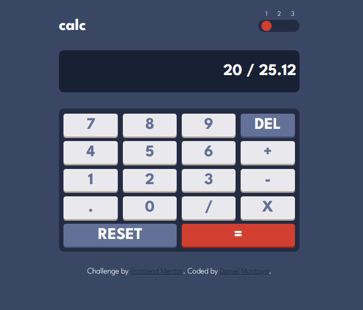

# Calculator app solution

This is a solution to the [Calculator app challenge on Frontend Mentor](https://www.frontendmentor.io/challenges/calculator-app-9lteq5N29). 

## Table of contents

- [Overview](#overview)
  - [The challenge](#the-challenge)
  - [Screenshot](#screenshot)
  - [Links](#links)
- [My process](#my-process)
  - [Built with](#built-with)
  - [What I learned](#what-i-learned)
- [Author](#author)

## Overview

### The challenge

Users should be able to:

- See the size of the elements adjust based on their device's screen size
- Perform mathematical operations like addition, subtraction, multiplication, and division
- Adjust the color theme based on their preference with the toggle button

### Screenshot

### Links

- [Solution URL](https://github.com/dnewbie25/Frontend-Mentor/tree/main/calculator-app)
- [Live Site URL](https://calculator-app-challenge.netlify.app/)

## My process

### Built with

- Semantic HTML5 markup
- SASS
- Javascript
- Mobile-first workflow

### What I learned

- Use Javascript in a more in-depth way, having to organize my logic and planning ahead what I was trying to accomplish.
- SCSS/SASS file managing to keep various tpes of layouts available for the users to display.

## Author

- Frontend Mentor - [@dnewbie25](https://www.frontendmentor.io/profile/dnewbie25)
- DevChallenges - [dnewbie25](https://devchallenges.io/portfolio/dnewbie25)