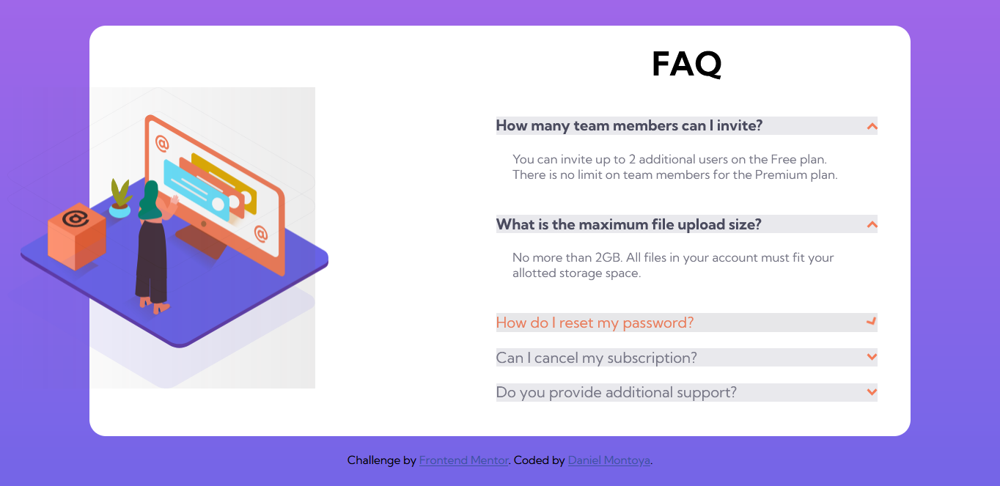

# FAQ accordion card solution

This is a solution to the [FAQ accordion card challenge on Frontend Mentor](https://www.frontendmentor.io/challenges/faq-accordion-card-XlyjD0Oam). 

## Table of contents

- [Overview](#overview)
  - [The challenge](#the-challenge)
  - [Screenshot](#screenshot)
  - [Links](#links)
- [My process](#my-process)
  - [Built with](#built-with)
  - [What I learned](#what-i-learned)
  - [Useful resources](#useful-resources)
- [Author](#author)

## Overview

### The challenge

Users should be able to:

- View the optimal layout for the component depending on their device's screen size
- See hover states for all interactive elements on the page
- Hide/Show the answer to a question when the question is clicked

### Screenshot

### Links

- [Solution URL](https://github.com/dnewbie25/Frontend-Mentor/tree/main/faq-accordion-card-main)
- [Live Site URL](https://faq-accordion-by-me.netlify.app)

## My process

### Built with

- Semantic HTML5 markup
- SASS
- Javascript
- Mobile-first workflow

### What I learned

Using CSS animations and how to activate them with Javascript to create the accordion. Absolute positioning was a recurrent topic in this challenge.

### Useful resources

- [How TO - Collapsibles/Accordion](https://www.w3schools.com/howto/howto_js_accordion.asp) 
- [Using CSS animations](https://developer.mozilla.org/en-US/docs/Web/CSS/CSS_Animations/Using_CSS_animations)

## Author

- Frontend Mentor - [@dnewbie25](https://www.frontendmentor.io/profile/dnewbie25)
- DevChallenges - [dnewbie25](https://devchallenges.io/portfolio/dnewbie25)