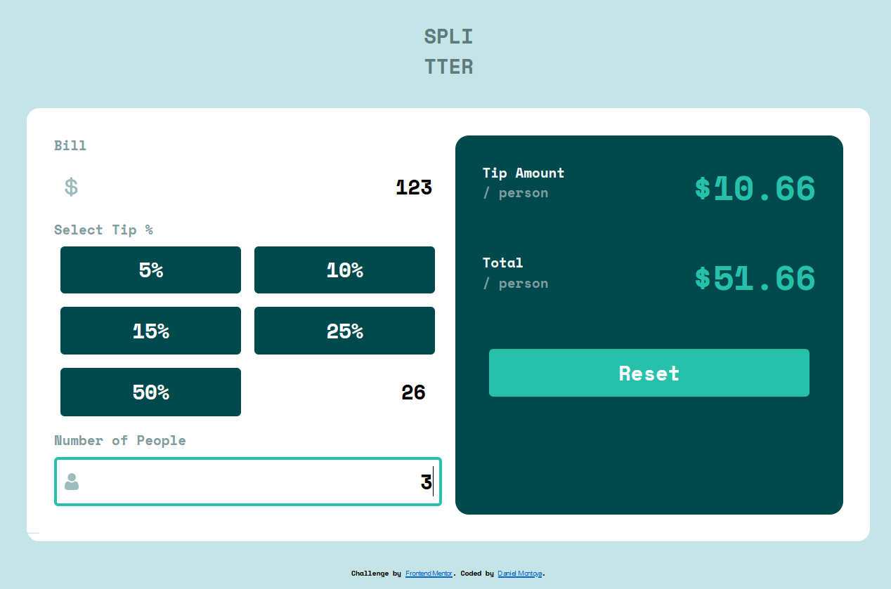

# Tip calculator app solution

This is a solution to the [Tip calculator app challenge on Frontend Mentor](https://www.frontendmentor.io/challenges/tip-calculator-app-ugJNGbJUX).

## Table of contents

- [Overview](#overview)
  - [The challenge](#the-challenge)
  - [Screenshot](#screenshot)
  - [Links](#links)
- [My process](#my-process)
  - [Built with](#built-with)
  - [What I learned](#what-i-learned)
- [Author](#author)

## Overview

### The challenge

Users should be able to:

- View the optimal layout for the app depending on their device's screen size
- See hover states for all interactive elements on the page
- Calculate the correct tip and total cost of the bill per person

### Screenshot

### Links

- [Solution URL](https://github.com/dnewbie25/Frontend-Mentor/tree/main/tip-calculator-app-main)
- [Live Site URL](https://tip-calculator-by-me.netlify.app)

## My process

### Built with

- Semantic HTML5 markup
- SASS with Flexbox / Grid
- ES6 classes for the calculator functionalities
- Mobile-first workflow

### What I learned

This was a good project to start implementing the new classes added to Javascript in ES6.

## Author

- Frontend Mentor - [@dnewbie25](https://www.frontendmentor.io/profile/dnewbie25)
- DevChallenges - [dnewbie25](https://devchallenges.io/portfolio/dnewbie25)
